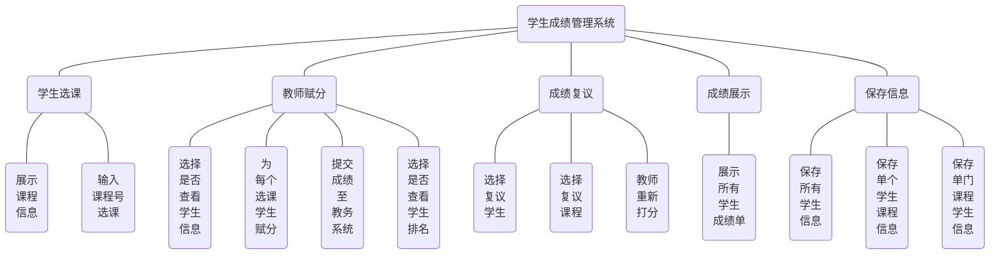
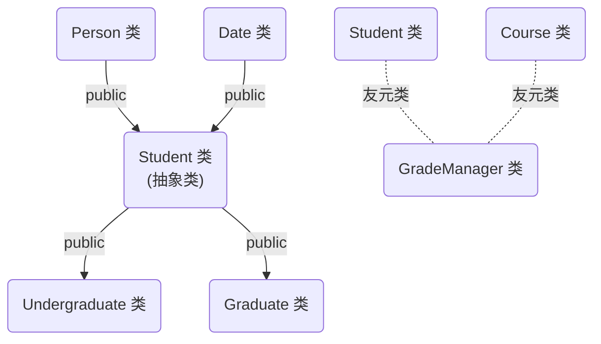

# 1 系统需求分析

## 1.1 项目简介

本课程设计选题为**学生成绩管理系统**，项目名称为 `GPAWizard` ，在 C++14 标准下编写，使用了部分现代 c++ 特性(如 lambda 表达式、 auto 类型推导等)。

在编译方面，本项目拥有四个 `*.hpp` 文件、五个 `*.cpp` 文件，故编写了 `CMakeLists.txt` 以使用 `cmake` 进行编译，在 Linux 以及 Windows 10 平台下编译通过。无特殊说明时，后续文档均为 Linux 下的运行情况， Windows 与之类似。

本项目主要分为四个文件夹，结构如下：

- `include`：放置头文件
- `src`：放置源文件
- `shared`：放置初始学生和课程信息、保存导出的各种文件
- `test`：放置测试文件

```bash
$ tree THU-GPAWizard
THU-GPAWizard
├── CMakeLists.txt
├── compile.sh
├── include
│   ├── Course.hpp
│   ├── GradeManager.hpp
│   ├── IOUtils.hpp
│   └── Student.hpp
├── run.sh
├── shared
│   ├── courses.txt
│   └── students.txt
├── src
│   ├── Course.cpp
│   ├── GradeManager.cpp
│   ├── IOUtils.cpp
│   ├── main.cpp
│   └── Student.cpp
├── test
│   ├── 1.ans
│   ├── 1.in
│   ├── 2.ans
│   └── 2.in
└── test.sh

4 directories, 19 files
```

## 1.2 需求分析

在清华大学一学期的学习中，课程繁重、相关信息不便于管理。为此，我设计了本成绩管理系统，为学生提供了更多自主选课的机会，并确保了透明公平的成绩评定，简化了教务管理流程，提高了工作效率。同时，项目最后保存的文件还可以为学校的教学决策提供数据来源。

本项目分为选课阶段、教师赋分、成绩复议、展示最终成绩、保存相关信息等环节。按照流程，本程序可分为如下过程：

- 学生首先选择自己想要上的课程，也可以不选课(那么成绩单就为空)。
- 经过一学期的学习后经教师给出百分制成绩，待所有教师为选课同学赋分完毕后，成绩会提交至教务系统，由教务系统进行整合再推送给学生，学生最终看到的是等级制成绩。

- 如果学生对自己的成绩有所疑惑，可以提交课程复议让教师重新打分

- 复议环节结束后，展示所有学生的最终成绩单。

- 在程序的最后，可以保存所有学生信息、保存某一门课程的学生信息、保存某个学生选择课程的信息等，可以按照姓名、学号(课程号)、成绩进行排序，默认为不排序。

本课程管理系统将学生、教师(课程)、教务系统分开来写，分别在 `Students.hpp/Students.cpp`、`Course.hpp/Course.cpp`以及`GradeManager.hpp/GradeManager.cpp` 中进行完成。教师与学生彼此独立，通过友元类 `GradeManager` 进行通讯，一定程度上保证了程序的合理性。

# 2 总体设计

本成绩管理系统根据清华大学每学期的教学环节加以改编而成。学生可以进行选课，老师能够看到选课的学生并给其赋分，最后经过成绩复议过程得到学生的总成绩单。每门课的老师在对选课学生打完分数后，还可以选择查看本课程学生的成绩排名。



## 2.1 具体细节及输入要求

- 选课阶段：学生根据展示的开设课程，输入 `8` 位课程号以进行选课，若该课程不存在或已经被选，则选课不成功，需要重新输入。每名学生选课完毕后输入 `0` 来结束。
- 教师赋分：教师可查看选课学生信息，并提交总评分数，分数为双精度浮点类型。此时初步的成绩会提交给教务并推送给学生，随后可选择是否查看学生成绩排名。
- 成绩复议：复议阶段会提示输入待复议学生的 `10` 位学号，若该学生不存在则需要重新输入。选择待复议学生后，会要求输入待复议课程的课程号，类似地，若该课程不存在则需要重新输入。随后由教师重新打分并提交，继续询问是否有课程需要替代，此时输入 `0` 可以结束当前学生的复议环节，再次输入 `0` 来结束整个复议流程。
- 成绩展示：该环节为系统打印输出成绩单，无需输入。
- 保存信息：该环节会提示是否保存相关信息，输入一个字节 `y` 或 `n` 来进行选择，判断逻辑为除了 `n` 或 `N` 之外均视为同意。


在每个需要用户输入信息的地方，都设置了输入检查，若输入类型错误则会提示重新输入。原理是使用函数模板来简化类型检测，在每次输入不成功后会清空缓存区，并打印传入的提示语。

```C++
template <typename T>
T checkInput(const std::string& prompt) {
    T input;
    std::cout << prompt;

    while (!(std::cin >> input)) {
        std::cin.clear();
        std::cin.ignore(std::numeric_limits<std::streamsize>::max(), '\n');
        std::cout << "Invalid input, please input again!" << std::endl
                  << prompt;
    }
    return input;
}
```

## 2.2 初始信息要求

课程信息存储在 `courses.txt` 。第 `1` 行为课程数目 `N` ，后续 `N` 行为每种课程的信息，从前到后为课程名、课程号、学分，用空格分开。

学生信息存储在 `students.txt` 。第 `1` 行从前到后为本科生数目 `N` 和研究生数目 `M` ，第 `2` 行到第 `N+1` 行为本科生信息，从前到后为姓名、学号、性别(1为男性，2为女性~~，暂不支持Transgender~~)、出生年、月、日、入学年份；第 `N+2` 到第 `N+M+1` 行为研究生信息，从前到后为姓名、学号、性别、出生年、月、日、导师姓名，均以空格隔开。

以如下的 `students.txt` 为例：

```
1 1
Tom 2021010552 1 2003 9 7 2021
Alice 2019310567 2 2001 6 30 Huang
```

表示有一名本科生，一名研究生。其中男性本科生 Tom 学号为 2021010552，出生于 2003 年 9 月 7 日，2021年入学；女性研究生 Alice 学号为 2019310567，出生于 2001 年 6 月 30 日，导师姓黄。

# 3 详细设计

## 3.1 类设计

本管理系统拥有 `7` 个类，分别是 `Course`， `Person`， `Date`， `Student`， `Undergraduate`， `Graduate` 以及 `GradeManager` 类，其中 `Student` 类为**抽象类**。

这七个类的关系如图所示：



满足如下要求

> 基本要求系统中设计的类的数目不少于4个，每个类中要有各自的属性（多于3个）和方法（多于3个）；需要定义一个抽象类，采用继承方式派生这些类。并设计一个多重继承的派生类。

`GPAWizard`的七个类的UML图如下所示：


## 3.2 功能模块设计

- 选课阶段

  ```mermaid
  graph LR
  start(开始选课)-->show(选择是否显示课程信息)-->n(不显示则查看 courses.txt 文档&#40不推荐&#41)
  start-->select(输入课程号选课&#40输入 0 结束&#41)-->legal(课程不存在或已选过,需重新输入)
  start-->change(当前同学选课结束,切换下一名学生)
  ```

- 教师赋分

  ```mermaid
  graph LR
  start(教师开始打分)-->show(选择是否展示选课学生信息&#40推荐展示&#41)-->skip(若无学生选课则自动跳过)
  start-->grade(依次给选课学生评分,数值需为浮点型百分制成绩)-->legal(输入不合法需重新输入)
  start-->rank(选择是否显示该课程学生排名)
  ```

- 成绩复议

  ```mermaid
  graph LR
  start(成绩复议开始)-->input(输入学生学号以开始复议&#40输入 0 结束&#41)-->legal(该学生不存在则需重新输入)
  start-->input1(输入待复议课程号&#40输入 0 结束&#41)-->legal2(该课程不存在则需重新输入)
  start-->grade(教师重新打分,然后返回上一步至结束)
  start-->turn(该学生复议结束,切换下一名学生)
  ```

- 成绩展示

  ```mermaid
  graph LR
  start(成绩展示)-->show(系统自动打印所有学生成绩单,计算 GPA)
  ```

- 保存信息

  ```mermaid
  graph LR
  start(保存信息)-->stu(保存所有学生信息)-->type(选择排序方式:姓名,学号,GPA)
  start-->stu_course(保存某个学生的课程信息)-->legal(该学生不存在则需重新输入)-->type
  start-->course_stu(保存某门课程的学生信息)-->legal1(该课程不存在则需重新输入)-->type
  ```

# 4 系统调试

## 4.1 编译

本项目使用 `cmake` 进行编译，编译结果放在 `build` 文件夹下，`cmake` 版本如下：

```bash
$ cmake --version            
cmake version 3.22.1

CMake suite maintained and supported by Kitware (kitware.com/cmake).
```

使用时先新建 `build` 文件夹，再在其中编译。为了方便使用，我写了一个小脚本 `compile.sh` 来辅助编译：

```bash
#!/bin/sh
if [ ! -d "build" ]; then
    mkdir build
fi
cd build
cmake ..
make -j12
```

使用时运行其即可：

```bash
$ ./compile.sh
-- The C compiler identification is GNU 11.4.0
-- The CXX compiler identification is GNU 11.4.0
-- Detecting C compiler ABI info
-- Detecting C compiler ABI info - done
-- Check for working C compiler: /usr/bin/cc - skipped
-- Detecting C compile features
-- Detecting C compile features - done
-- Detecting CXX compiler ABI info
-- Detecting CXX compiler ABI info - done
-- Check for working CXX compiler: /usr/bin/c++ - skipped
-- Detecting CXX compile features
-- Detecting CXX compile features - done
-- Configuring done
-- Generating done
-- Build files have been written to: /home/zlysm/Code/C++/THU-GPAWizard/build
[ 50%] Building CXX object CMakeFiles/GPAWizard.dir/src/Course.cpp.o
[ 50%] Building CXX object CMakeFiles/GPAWizard.dir/src/GradeManager.cpp.o
[ 50%] Building CXX object CMakeFiles/GPAWizard.dir/src/main.cpp.o
[ 66%] Building CXX object CMakeFiles/GPAWizard.dir/src/Student.cpp.o
[ 83%] Building CXX object CMakeFiles/GPAWizard.dir/src/IOUtils.cpp.o
[100%] Linking CXX executable GPAWizard
[100%] Built target GPAWizard
```

## 4.2 运行

运行 `run.sh` 即可启动本项目

```bash
#!/bin/sh
./build/GPAWizard
```

## 4.3 测试

本次测试选择 `test/1.in` 测试文件。

为了方便测试，我写了 `test.sh` 脚本进行辅助。运行时在其后添加一个数字参数 ` *` ，即可使用输入输出重定向将 `*.in` 的测试结果保存至 `*.ans` ：

```bash
#!/bin/sh

test_number="$1"
input_file="test/${test_number}.in"
output_file="test/${test_number}.ans"

./run.sh <"$input_file" >"$output_file"
```

在这里我们手动进行输入（未列出部分重复环节，完整测试可使用测试文件）。


初始时可看到加载了四名学生以及四门课程，并提示了五个阶段。

**在选课阶段**，我们选择查看课程信息：


接下来我们为 `Tom` 进行选课：


我们为 `Tom` 选择了`电电`，`原神`，`程设`以及`游泳课`，并输入 `0` 来结束他的选课过程。随后继续为其他同学选课，不再赘述。


注意到，当重复选课、课程号错误、输入不合法时，系统均能给出正确的提示。接下来我们进入到教师打分环节（本程序百分制与等级制对应关系与清华大学相同）。


我们先显示选课学生信息，然后为其打分。注意到，当输入字母（不合法数据）时，会提示重新输入。


所有课程打分完成后，可以展示各课程学生成绩排名。

**接下来是复议环节。**`Bob`发现自己的`原神`课程挂科了，想要进行成绩复议：


老师重新给他打了 `61` 分的分数，我们选择课程复议环节结束（当输入错误的课程号时，会提示找不到该课程）。

**进入到成绩展示环节**，系统会自动打印出所有同学的成绩单（`Alice` 为未选课同学）：


**进入到保存信息环节。**

先按照GPA降序的方法，保存所有学生信息至 `shared/StudentsInfo.csv`：


我们再来按照课程号排序的方法保存 `Tom` 的课程信息（每个同学的课程信息文件名为 `学生姓名.csv`）：


最后，我们来按照姓名排序的方法，保存`原神`课程的学生信息：


至此，整个程序结束，谢谢使用！

# 5 结果分析

# 6 总结

# 附录1：源程序清单

## main.cpp

```C++
#include "GradeManager.hpp"
#include "IOUtils.hpp"

int Student::studentCount = 0;
int Course::courseCount = 0;

int main() {
    std::vector<Student*> students;
    std::vector<Course*> courses;

    IO::loadStudents(students, "shared/students.txt");
    IO::loadCourses(courses, "shared/courses.txt");

    GradeManager manager(students, courses);

    std::cout << "-------------Welcome to GPAWizard!-------------" << std::endl;
    std::cout << "Stages:" << std::endl
              << "1. Student select courses" << std::endl
              << "2. Teacher set grades and push to Academic Affairs" << std::endl
              << "3. Grade query and reconsideration" << std::endl
              << "4. Show final course report" << std::endl
              << "5. Save Students and Courses" << std::endl;

    // select courses
    std::cout << std::endl
              << "--------Stage 1: Student select courses--------" << std::endl
              << std::endl;

    char choice = IO::checkInput<char>(
        "Do you want to see all " + std::to_string(Course::getCourseCount()) + " courses? (y/n)");
    if ('n' != choice && 'N' != choice)
        for (auto& course : courses)
            std::cout << *course;
    manager.studentSelectCourse();

    // set grades
    std::cout
        << "----------Stage 2: Teacher set grades----------" << std::endl
        << std::endl;
    manager.teacherSetGrade();
    manager.pushGrade();

    std::cout << "All " << Course::getCourseCount()
              << " courses' grades have been pushed to Academic Affairs." << std::endl;
    choice = IO::checkInput<char>("Do you want to see all courses' students rank? (y/n)");
    if ('n' != choice && 'N' != choice)
        for (auto& course : courses)
            course->showStudentsRankList();

    // grade reconsideration
    std::cout << std::endl
              << "-------Stage 3: Query and Reconsideration------" << std::endl
              << std::endl;

    auto findStudent([&](int id) {
        for (auto& student : students)
            if (student->getID() == id)
                return student;
        return (Student*)nullptr;
    });

    auto findCourse([&](int number) {
        for (auto& course : courses)
            if (course->getCourseInfo().number == number)
                return course;
        return (Course*)nullptr;
    });

    const std::string queryPrompt = "Please input the student's id you want to query(0 to finish): ";
    const std::string reconsiderPrompt = "Please input the course number you want to reconsider(0 to finish): ";

    for (int queryID = IO::checkInput<int>(queryPrompt); 0 != queryID;
         queryID = IO::checkInput<int>(queryPrompt)) {
        auto student = findStudent(queryID);
        if (!student) {
            std::cout << "Student not found." << std::endl;
            continue;
        }
        student->showCourseReport();

        for (int courseNumber = IO::checkInput<int>(reconsiderPrompt); 0 != courseNumber;
             courseNumber = IO::checkInput<int>(reconsiderPrompt)) {  // get course number, 0 to finish
            auto course = findCourse(courseNumber);
            if (!course) {
                std::cout << "Course not found." << std::endl;
                continue;
            }

            if (course->setGrade(student->getID())) {
                manager.pushGrade(courseNumber);
                std::cout << "Successfully pushed grade to Academic Affairs." << std::endl
                          << std::endl;
            }
        }
        std::cout << "Student " << student->getName() << " reconsideration finished." << std::endl
                  << std::endl;
    }

    // show final course report
    std::cout << std::endl
              << "-------Stage 4: Show final course report-------" << std::endl
              << std::endl;
    for (const auto& student : students)
        student->showCourseReport();

    // save students and courses
    std::cout << std::endl
              << "--------Stage 5: Save Students/Courses---------" << std::endl
              << std::endl;

    const std::string savePrompt =
        "Select the sorting method you want(default is 0): \n"
        "1. Name\n"
        "2. ID\n"
        "3. GPA\n";

    choice = IO::checkInput<char>("Do you want to save all " + std::to_string(Student::getStudentCount()) + " students? (y/n)");
    if ('n' != choice && 'N' != choice) {
        int sortType = IO::checkInput<int>(savePrompt);
        manager.saveStudents(static_cast<IO::SortType>(sortType));  // overload function, save all students
        std::cout << std::endl;
    }

    choice = IO::checkInput<char>("Do you want to save a student's courses info? (y/n)");
    if ('n' != choice && 'N' != choice) {
        const std::string studentPrompt = "Please input the student's id(0 to finish): ";
        for (int studentID = IO::checkInput<int>(studentPrompt); 0 != studentID;
             studentID = IO::checkInput<int>(studentPrompt)) {  // get student id, 0 to finish
            if (!findStudent(studentID)) {
                std::cout << "Student not found." << std::endl;
                continue;
            }
            int sortType = IO::checkInput<int>(savePrompt);
            manager.saveStudents(studentID, static_cast<IO::SortType>(sortType));
            std::cout << std::endl;
        }
    }

    choice = IO::checkInput<char>("Do you want to save a course's students info? (y/n)");
    if ('n' != choice && 'N' != choice) {
        const std::string coursePrompt = "Please input the course number(0 to finish): ";
        for (int courseNumber = IO::checkInput<int>(coursePrompt); 0 != courseNumber;
             courseNumber = IO::checkInput<int>(coursePrompt)) {  // get course number, 0 to finish
            if (!findCourse(courseNumber)) {
                std::cout << "Course not found." << std::endl;
                continue;
            }
            int sortType = IO::checkInput<int>(savePrompt);
            manager.saveCourses(courseNumber, static_cast<IO::SortType>(sortType));
            std::cout << std::endl;
        }
    }

    std::cout << "---------------Thanks for using!---------------" << std::endl;

    return 0;
}
```

## Course.hpp

```c++
#ifndef COURSE_HPP
#define COURSE_HPP

#include <algorithm>
#include <iomanip>
#include <iostream>
#include <string>
#include <unordered_map>
#include <utility>
#include <vector>

typedef struct {
    std::string name;
    int number, credits;
} CourseInfo;

using StudentInfo = std::pair<std::string, double>;

class Course {
   public:
    Course(std::string name, int number, int credits);

    ~Course();

    CourseInfo getCourseInfo() const;

    void updateStudentList(int studentID, const std::string& studentName);

    void setGrade();  // set grade for all students

    bool setGrade(int studentID);  // set grade for a specific student, return false if student not found

    void showStudentsRankList() const;

    static int getCourseCount();

    friend std::ostream& operator<<(std::ostream& os, const Course& course);

   private:
    std::string _name;
    int _number;
    int _credits;
    static int courseCount;

    std::unordered_map<int, StudentInfo> _students;  // <id, <name, grade>>

    friend class GradeManager;
};

#endif  // COURSE_HPP
```

## Course.cpp

```C++
#include "Course.hpp"

#include "IOUtils.hpp"

Course::Course(std::string name, int number, int credits)
    : _name(std::move(name)), _number(number), _credits(credits) {
    ++courseCount;
}

Course::~Course() {
    --courseCount;
}

CourseInfo Course::getCourseInfo() const {
    return {_name, _number, _credits};
}

void Course::updateStudentList(int studentID, const std::string &studentName) {
    _students[studentID] = {studentName, 0};
}

void Course::setGrade() {
    if (_students.empty()) {
        std::cout << "No student in " << _name << " course." << std::endl
                  << std::endl;
        return;
    }

    std::cout << "Set grade for " << _name << " (course number: " << _number << "): " << std::endl;
    for (auto &_student : _students) {
        double grade = IO::checkInput<double>(
            "Please input the grade of " + _student.second.first + ": ");
        _student.second.second = grade;  // _students.secone = <name, grade>
    }

    std::cout << "Grades have been set." << std::endl
              << std::endl;
}

bool Course::setGrade(int studentID) {
    if (_students.find(studentID) == _students.end()) {
        std::cout << "No student with id " << studentID << " in " << _name << " course." << std::endl;
        return false;
    }
    double grade = IO::checkInput<double>(
        "Please input the grade of " + _students.at(studentID).first + " in " + _name + ": ");

    _students.at(studentID).second = grade;  // _students.secone = <name, grade>
    std::cout << "Grade has been set." << std::endl;
    return true;
}

void Course::showStudentsRankList() const {
    if (_students.empty()) {
        std::cout << "No student in " << _name << " course." << std::endl;
        return;
    }

    std::vector<StudentInfo> students;  // <name, grade>
    students.reserve(_students.size());
    for (const auto &_student : _students)
        students.emplace_back(_student.second.first, _student.second.second);

    std::sort(students.begin(), students.end(),
              [](const StudentInfo &a, const StudentInfo &b) {
                  return a.second > b.second;
              });  // sort by grade

    std::cout << "-------------------Rank List-------------------" << std::endl;
    std::cout << std::left;
    std::cout << std::setw(30) << "          Course: " << _name << std::endl;
    for (const auto &student : students)
        std::cout << std::setw(30) << "          " + student.first + ": " << student.second << std::endl;
    std::cout << "-----------------------------------------------" << std::endl;
}

int Course::getCourseCount() {
    return courseCount;
}

std::ostream &operator<<(std::ostream &os, const Course &course) {
    os << "------------------Course Info------------------" << std::endl;
    os << std::left;
    os << std::setw(30) << "          Name: " << course._name << std::endl;
    os << std::setw(30) << "          Number: " << course._number << std::endl;
    os << std::setw(30) << "          Credits: " << course._credits << std::endl;
    os << "-----------------------------------------------" << std::endl;
    return os;
}
```

## Student.hpp

```C++
#ifndef STUDENT_HPP
#define STUDENT_HPP

#include "Course.hpp"

class Person {
   public:
    Person(std::string name, int id, int gender);

    int getID() const;

    const std::string &getName() const;

    std::string getGender() const;

   protected:
    std::string _name;
    int _id;
    int _gender;  // 1 for male, 2 for female
};

class Date {
   public:
    explicit Date(int year = 2000, int month = 1, int day = 1);

    std::string getBirth() const;

   protected:
    int _year;
    int _month;
    int _day;
};

class Student : public Person, public Date {
   public:
    Student(std::string name, int id, int gender, int year, int month, int day);

    virtual ~Student();

    void selectCourse(const CourseInfo &course);

    void calculateGPA();

    void showCourseReport();

    double getGPA() const;

    static int getStudentCount();

    virtual void showInfo() const = 0;

    bool operator<(const Student &stu) const;

   protected:
    std::vector<CourseInfo> _courses;
    std::unordered_map<int, double> _courseGrades;
    double _gpa;

    static int studentCount;
    friend class GradeManager;

   private:
    static double grade2GPA(double);
};

class Undergraduate : public Student {
   public:
    Undergraduate(std::string name, int id, int gender, int year, int month, int day, int startYear = 2000);

    int getStartYear() const;

    void showInfo() const override;

   private:
    int _startYear;
};

class Graduate : public Student {
   public:
    Graduate(std::string name, int id, int gender, int year, int month, int day, std::string supervisor);

    const std::string &getSupervisor() const;

    void showInfo() const override;

   private:
    std::string _supervisor;
};

#endif  // STUDENT_HPP
```

## Student.cpp

```C++
#include "Student.hpp"

// Person

Person::Person(std::string name, int id, int gender)
    : _name(std::move(name)), _id(id), _gender(gender) {}

int Person::getID() const { return _id; }

const std::string& Person::getName() const { return _name; }

std::string Person::getGender() const {
    return _gender == 1 ? "Male" : "Female";
}

// Date

Date::Date(int year, int month, int day)
    : _year(year), _month(month), _day(day) {}

std::string Date::getBirth() const {
    return std::to_string(_month) + "/" + std::to_string(_day) + "/" + std::to_string(_year);
}

// Student

Student::Student(std::string name, int id, int gender, int year, int month, int day)
    : Person(std::move(name), id, gender), Date(year, month, day) {
    ++studentCount;
    _gpa = 0;
}

Student::~Student() { --studentCount; }

void Student::selectCourse(const CourseInfo& course) {
    _courses.push_back(course);
    _courseGrades[course.number] = 0;
}

void Student::calculateGPA() {
    double sum = 0;
    int totalCredits = 0;
    for (const auto& course : _courses) {
        sum += grade2GPA(_courseGrades.at(course.number)) * course.credits;
        totalCredits += course.credits;
    }
    _gpa = (sum == 0) ? 0 : (sum / totalCredits);  // avoid dividing by zero
}

void Student::showCourseReport() {
    std::cout << std::left;
    std::cout << "-------------Student Course Report-------------" << std::endl;
    std::cout << std::setw(15) << "Student: " << std::setw(10) << _name << _id << std::endl;
    std::cout << std::setw(15) << "Course Name" << std::setw(15) << "Course Number"
              << std::setw(10) << "Credits"
              << "GPA" << std::endl;

    for (const auto& course : _courses)
        std::cout << std::setw(15) << course.name << std::setw(15) << course.number
                  << std::setw(10) << course.credits << std::setprecision(1) << std::fixed
                  << grade2GPA(_courseGrades.at(course.number)) << std::endl;

    std::cout << "Total GPA: " << std::setprecision(2) << _gpa << std::endl;
    std::cout << "-----------------------------------------------" << std::endl
              << std::endl;
}

double Student::getGPA() const { return _gpa; }

int Student::getStudentCount() { return studentCount; }

bool Student::operator<(const Student& stu) const { return _gpa < stu._gpa; }

inline double Student::grade2GPA(double grade) {
    if (grade >= 90)
        return 4.0;
    else if (grade >= 85)
        return 3.6;
    else if (grade >= 80)
        return 3.3;
    else if (grade >= 77)
        return 3.0;
    else if (grade >= 73)
        return 2.6;
    else if (grade >= 70)
        return 2.3;
    else if (grade >= 67)
        return 2.0;
    else if (grade >= 63)
        return 1.6;
    else if (grade >= 60)
        return 1.3;
    else
        return 0;
}

// Undergraduate

Undergraduate::Undergraduate(std::string name, int id, int gender,
                             int year, int month, int day,
                             int startYear)
    : Student(std::move(name), id, gender, year, month, day), _startYear(startYear) {}

int Undergraduate::getStartYear() const { return _startYear; }

void Undergraduate::showInfo() const {
    std::cout << "-------Undergraduate Student information-------" << std::endl;
    std::cout << std::left;
    std::cout << std::setw(30) << "          Name: " << _name << std::endl;
    std::cout << std::setw(30) << "          ID: " << _id << std::endl;
    std::cout << std::setw(30) << "          Gender: " << getGender() << std::endl;
    std::cout << std::setw(30) << "          BirthDate: " << getBirth() << std::endl;
    std::cout << std::setw(30) << "          Year: " << _startYear << std::endl;
    std::cout << "-----------------------------------------------" << std::endl;
}

// Graduate

Graduate::Graduate(std::string name, int id, int gender,
                   int year, int month, int day,
                   std::string supervisor)
    : Student(std::move(name), id, gender, year, month, day), _supervisor(std::move(supervisor)) {}

const std::string& Graduate::getSupervisor() const { return _supervisor; }

void Graduate::showInfo() const {
    std::cout << "----------Graduate Student information---------" << std::endl;
    std::cout << std::left;
    std::cout << std::setw(30) << "          Name: " << _name << std::endl;
    std::cout << std::setw(30) << "          ID: " << _id << std::endl;
    std::cout << std::setw(30) << "          Gender: " << getGender() << std::endl;
    std::cout << std::setw(30) << "          BirthDate: " << getBirth() << std::endl;
    std::cout << std::setw(30) << "          Supervisor: " << _supervisor << std::endl;
    std::cout << "-----------------------------------------------" << std::endl;
}
```

## GradeManager.hpp

```C++
#ifndef GRADE_MANAGER_HPP
#define GRADE_MANAGER_HPP

#include "IOUtils.hpp"

using IO::SortType;

class GradeManager {
   public:
    GradeManager(std::vector<Student*>& students, std::vector<Course*>& courses);

    ~GradeManager();

    void studentSelectCourse();

    void teacherSetGrade();

    void pushGrade();  // when teacher set all course's grade, push it to students

    bool pushGrade(int courseNumber);  // modify a course's grade

    void saveStudents(SortType type = SortType::NONE);  // save all students

    bool saveStudents(int studentID, SortType type = SortType::NONE);  // save a student's courses

    bool saveCourses(int courseID, SortType type = SortType::NONE);  // save a course's students

   private:
    std::vector<Student*> _students;
    std::vector<Course*> _courses;
};

#endif  // GRADE_MANAGER_HPP
```

## GradeManager.cpp

```C++
#include "GradeManager.hpp"

GradeManager::GradeManager(std::vector<Student*>& students, std::vector<Course*>& courses)
    : _students(students), _courses(courses) {}

GradeManager::~GradeManager() {
    for (auto& student : _students)
        delete student;
    for (auto& course : _courses)
        delete course;
}

void GradeManager::studentSelectCourse() {
    for (auto& student : _students) {
        std::cout << "Student " << student->getName() << " select courses: " << std::endl;

        const std::string prompt = "Input course number to select(0 to finish): ";

        for (int courseNumber = IO::checkInput<int>(prompt); 0 != courseNumber;
             courseNumber = IO::checkInput<int>(prompt)) {
            bool selected = false;  // check if the course has already been selected
            for (const auto& course : student->_courses)
                if (course.number == courseNumber) {
                    selected = true;
                    std::cout << "Course " << course.name << " has already been selected." << std::endl;
                    break;
                }
            if (selected) continue;

            bool found = false;
            for (const auto& course : _courses)
                if (course->_number == courseNumber) {
                    found = true;
                    student->selectCourse(course->getCourseInfo());                   // push course to student
                    course->updateStudentList(student->getID(), student->getName());  // push student to course
                    std::cout << "Course " << course->_name << " selected." << std::endl
                              << std::endl;
                    break;
                }

            if (!found)
                std::cout << "Course not found." << std::endl;
        }
        std::cout << "Student " << student->getName() << " select courses finished." << std::endl
                  << std::endl;
    }
}

void GradeManager::teacherSetGrade() {
    for (auto& course : _courses)
        if (!course->_students.empty()) {
            const std::string prompt = "Do you want to see all " + std::to_string(course->_students.size()) +
                                       " students' info in " + course->_name + " course? (y/n)";
            char choice = IO::checkInput<char>(prompt);
            if ('n' != choice && 'N' != choice)
                for (const auto& courseStu : course->_students)  // for all students in this course
                    for (const auto& student : _students)        // fine the student in all students
                        if (student->getID() == courseStu.first) {
                            student->showInfo();
                            break;
                        }
            course->setGrade();
        }
}

void GradeManager::pushGrade() {
    for (const auto& course : _courses)                   // for all courses
        for (const auto& courseStu : course->_students)   // for all students in this course
            for (auto& student : _students)               // find the student in all students
                if (student->getID() == courseStu.first)  // push grade to student
                    student->_courseGrades[course->_number] = course->_students.at(courseStu.first).second;

    for (auto& student : _students)  // update all students' GPA
        student->calculateGPA();
}

bool GradeManager::pushGrade(int courseNumber) {
    for (const auto& course : _courses)  // find the course
        if (course->_number == courseNumber) {
            for (const auto& courseStu : course->_students)  // for all students in this course
                for (auto& student : _students)              // find the student in all students
                    if (student->getID() == courseStu.first) {
                        student->_courseGrades[courseNumber] = course->_students.at(courseStu.first).second;
                        student->calculateGPA();
                    }
            return true;
        }
    return false;
}

void GradeManager::saveStudents(SortType type) {
    auto students = _students;
    std::ofstream fout("shared/StudentsInfo.csv", std::ios::trunc);
    if (!fout.is_open()) {
        std::cerr << "Error opening file StudentsInfo.csv" << std::endl;
        exit(1);
    }

    switch (type) {
        case SortType::NAME:
            std::sort(students.begin(), students.end(), [](Student* a, Student* b) {
                return a->getName() < b->getName();
            });
            break;
        case SortType::NUMBER:
            std::sort(students.begin(), students.end(), [](Student* a, Student* b) {
                return a->getID() > b->getID();
            });
            break;
        case SortType::GRADE:
            std::sort(students.begin(), students.end(), [](Student* a, Student* b) {
                return a->getGPA() > b->getGPA();
            });
            break;
        case SortType::NONE:
        default:
            break;
    }

    fout << "Name,ID,Gender,Birth date,GPA" << std::endl;
    for (const auto& student : students)
        fout << student->getName() << "," << student->getID() << "," << student->getGender() << ","
             << student->getBirth() << "," << student->getGPA() << std::endl;

    fout.close();
    std::cout << "Successfully saved students info to StudentsInfo.csv" << std::endl;
}

bool GradeManager::saveStudents(int studentID, SortType type) {
    Student* student = nullptr;
    bool found = false;
    for (const auto& stu : _students)
        if (stu->getID() == studentID) {
            student = stu;
            found = true;
            break;
        }
    if (!found) return false;

    std::ofstream fout("shared/" + student->getName() + ".csv", std::ios::trunc);
    if (!fout.is_open()) {
        std::cerr << "Error opening file " << student->getName() << ".csv" << std::endl;
        exit(1);
    }

    std::vector<std::pair<CourseInfo, double>> courses;  // <course info, grade>
    courses.reserve(student->_courses.size());
    for (const auto& stuCourse : student->_courses)
        courses.emplace_back(stuCourse, student->_courseGrades.at(stuCourse.number));

    switch (type) {
        case SortType::NAME:
            std::sort(courses.begin(), courses.end(),
                      [](const std::pair<CourseInfo, double>& a, const std::pair<CourseInfo, double>& b) {
                          return a.first.name < b.first.name;
                      });
            break;
        case SortType::NUMBER:
            std::sort(courses.begin(), courses.end(),
                      [](const std::pair<CourseInfo, double>& a, const std::pair<CourseInfo, double>& b) {
                          return a.first.number > b.first.number;
                      });
            break;
        case SortType::GRADE:
            std::sort(courses.begin(), courses.end(),
                      [](const std::pair<CourseInfo, double>& a, const std::pair<CourseInfo, double>& b) {
                          return a.second > b.second;
                      });
            break;
        case SortType::NONE:
        default:
            break;
    }

    fout << "Name,Number,Credit,Grade,GPA" << std::endl;
    for (const auto& course : courses)
        fout << course.first.name << "," << course.first.number << "," << course.first.credits << ","
             << course.second << "," << Student::grade2GPA(course.second) << std::endl;

    fout.close();
    std::cout << "Successfully saved student " << student->getName() << "'s courses info to " << student->getName()
              << ".csv" << std::endl;
    return true;
}

bool GradeManager::saveCourses(int courseID, SortType type) {
    Course* course = nullptr;
    bool found = false;
    for (const auto& cou : _courses)
        if (cou->_number == courseID) {
            course = cou;
            found = true;
            break;
        }
    if (!found) return false;

    std::ofstream fout("shared/" + course->_name + ".csv", std::ios::trunc);
    if (!fout.is_open()) {
        std::cerr << "Error opening file " << course->_name << ".csv" << std::endl;
        exit(1);
    }

    std::vector<std::pair<int, StudentInfo>> students;  // <student id, student info>
    students.reserve(course->_students.size());
    for (const auto& stu : course->_students)
        students.emplace_back(stu.first, stu.second);

    switch (type) {
        case SortType::NAME:
            std::sort(students.begin(), students.end(),
                      [](const std::pair<int, StudentInfo>& a, const std::pair<int, StudentInfo>& b) {
                          return a.second.first < b.second.first;
                      });
            break;
        case SortType::NUMBER:
            std::sort(students.begin(), students.end(),
                      [](const std::pair<int, StudentInfo>& a, const std::pair<int, StudentInfo>& b) {
                          return a.first > b.first;
                      });
            break;
        case SortType::GRADE:
            std::sort(students.begin(), students.end(),
                      [](const std::pair<int, StudentInfo>& a, const std::pair<int, StudentInfo>& b) {
                          return a.second.second > b.second.second;
                      });
            break;
        case SortType::NONE:
        default:
            break;
    }

    fout << "Name,ID,Grade,GPA" << std::endl;
    for (const auto& stu : students) {
        double grade = course->_students.at(stu.first).second;
        fout << stu.second.first << "," << stu.first << "," << grade << "," << Student::grade2GPA(grade) << std::endl;
    }

    fout.close();
    std::cout << "Successfully saved course " << course->_name << "'s students info to " << course->_name
              << ".csv" << std::endl;
    return true;
}
```

## IOUtils.hpp

```C++
#ifndef IO_UTILS_HPP
#define IO_UTILS_HPP

#include <fstream>
#include <limits>

#include "Course.hpp"
#include "Student.hpp"

namespace IO {
typedef enum { NAME = 1,
               NUMBER,
               GRADE,
               NONE = 0 } SortType;

void loadStudents(std::vector<Student*>& students, const std::string& filename);

void loadCourses(std::vector<Course*>& courses, const std::string& filename);

template <typename T>
T checkInput(const std::string& prompt) {
    T input;
    std::cout << prompt;

    while (!(std::cin >> input)) {
        std::cin.clear();
        std::cin.ignore(std::numeric_limits<std::streamsize>::max(), '\n');
        std::cout << "Invalid input, please input again!" << std::endl
                  << prompt;
    }
    return input;
}
}  // namespace IO

#endif  // IO_UTILS_HPP
```

## IOUtils.cpp

```C++
#include "IOUtils.hpp"

namespace IO {
void loadStudents(std::vector<Student*>& students, const std::string& filename) {
    // first line is the number of undergraduate students and graduate students
    // rest of the lines are students info, the first part is undergraduate student
    // lines: name id gender (supervisor) year
    std::ifstream fin(filename);
    if (!fin.is_open()) {
        std::cerr << "Error opening file " << filename << std::endl;
        exit(1);
    }

    int undergradCount, gradCount;
    fin >> undergradCount >> gradCount;
    for (int i = 0; i < undergradCount; ++i) {
        std::string name;
        int id, gender, year, month, day, startYear;
        fin >> name >> id >> gender >> year >> month >> day >> startYear;
        students.push_back(new Undergraduate(name, id, gender, year, month, day, startYear));
    }

    for (int i = 0; i < gradCount; ++i) {
        std::string name, supervisor;
        int id, gender, year, month, day;
        fin >> name >> id >> gender >> year >> month >> day >> supervisor;
        students.push_back(new Graduate(name, id, gender, year, month, day, supervisor));
    }
    fin.close();
    std::cout << "Successfully loaded " << undergradCount << " undergraduate students and "
              << gradCount << " graduate students." << std::endl;
}

void loadCourses(std::vector<Course*>& courses, const std::string& filename) {
    // first line is the number of courses
    // rest of the lines are courses info
    // lines: name id credit
    std::ifstream fin(filename);
    if (!fin.is_open()) {
        std::cerr << "Error opening file " << filename << std::endl;
        exit(1);
    }

    int courseCount;
    fin >> courseCount;
    for (int i = 0; i < courseCount; ++i) {
        std::string name;
        int id, credit;
        fin >> name >> id >> credit;
        courses.push_back(new Course(name, id, credit));
    }
    fin.close();
    std::cout << "Successfully loaded " << courseCount << " courses." << std::endl;
}

}  // namespace IO
```
