# 1 系统需求分析

## 1.1 项目简介

本课程设计选题为**学生成绩管理系统**，项目名称为 `GPAWizard` ，在 C++14 标准下编写，使用了部分现代 c++ 特性(如 lambda 表达式、 auto 类型推导等)。

在编译方面，本项目拥有四个 `*.hpp` 文件、五个 `*.cpp` 文件，故编写了 `CMakeLists.txt` 以使用 `cmake` 进行编译，在 Linux 以及 Windows 10 平台下编译通过。无特殊说明时，后续文档均为 Linux 下的运行情况， Windows 与之类似。

本项目主要分为四个文件夹，结构如下：

- `include`：放置头文件
- `src`：放置源文件
- `shared`：放置初始学生和课程信息、保存导出的各种文件
- `test`：放置测试文件

```bash
$ tree THU-GPAWizard
THU-GPAWizard
├── CMakeLists.txt
├── compile.sh
├── include
│   ├── Course.hpp
│   ├── GradeManager.hpp
│   ├── IOUtils.hpp
│   └── Student.hpp
├── run.sh
├── shared
│   ├── courses.txt
│   └── students.txt
├── src
│   ├── Course.cpp
│   ├── GradeManager.cpp
│   ├── IOUtils.cpp
│   ├── main.cpp
│   └── Student.cpp
├── test
│   ├── 1.ans
│   ├── 1.in
│   ├── 2.ans
│   └── 2.in
└── test.sh

4 directories, 19 files
```

## 1.2 需求分析

在清华大学一学期的学习中，课程繁重、相关信息不便于管理。为此，我设计了本成绩管理系统，为学生提供了更多自主选课的机会，并确保了透明公平的成绩评定，简化了教务管理流程，提高了工作效率。同时，项目最后保存的文件还可以为学校的教学决策提供数据来源。

本项目分为选课阶段、教师赋分、成绩复议、展示最终成绩、保存相关信息等环节。按照流程，本程序可分为如下过程：

- 学生首先选择自己想要上的课程，也可以不选课(那么成绩单就为空)。
- 经过一学期的学习后经教师给出百分制成绩，待所有教师为选课同学赋分完毕后，成绩会提交至教务系统，由教务系统进行整合再推送给学生，学生最终看到的是等级制成绩。

- 如果学生对自己的成绩有所疑惑，可以提交课程复议让教师重新打分

- 复议环节结束后，展示所有学生的最终成绩单。

- 在程序的最后，可以保存所有学生信息、保存某一门课程的学生信息、保存某个学生选择课程的信息等，可以按照姓名、学号(课程号)、成绩进行排序，默认为不排序。

本课程管理系统将学生、教师(课程)、教务系统分开来写，分别在 `Students.hpp/Students.cpp`、`Course.hpp/Course.cpp`以及`GradeManager.hpp/GradeManager.cpp` 中进行完成。教师与学生彼此独立，通过友元类 `GradeManager` 进行通讯，一定程度上保证了程序的合理性。

# 2 总体设计

本成绩管理系统根据清华大学每学期的教学环节加以改编而成。学生可以进行选课，老师能够看到选课的学生并给其赋分，最后经过成绩复议过程得到学生的总成绩单。每门课的老师在对选课学生打完分数后，还可以选择查看本课程学生的成绩排名。

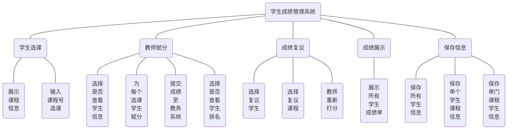

## 2.1 具体细节及输入要求

- 选课阶段：学生根据展示的开设课程，输入 `8` 位课程号以进行选课，若该课程不存在或已经被选，则选课不成功，需要重新输入。每名学生选课完毕后输入 `0` 来结束。
- 教师赋分：教师可查看选课学生信息，并提交总评分数，分数为双精度浮点类型。此时初步的成绩会提交给教务并推送给学生，随后可选择是否查看学生成绩排名。
- 成绩复议：复议阶段会提示输入待复议学生的 `10` 位学号，若该学生不存在则需要重新输入。选择待复议学生后，会要求输入待复议课程的课程号，类似地，若该课程不存在则需要重新输入。随后由教师重新打分并提交，继续询问是否有课程需要替代，此时输入 `0` 可以结束当前学生的复议环节，再次输入 `0` 来结束整个复议流程。
- 成绩展示：该环节为系统打印输出成绩单，无需输入。
- 保存信息：该环节会提示是否保存相关信息，输入一个字节 `y` 或 `n` 来进行选择，判断逻辑为除了 `n` 或 `N` 之外均视为同意。


在每个需要用户输入信息的地方，都设置了输入检查，若输入类型错误则会提示重新输入。原理是使用函数模板来简化类型检测，在每次输入不成功后会清空缓存区，并打印传入的提示语。

```C++
template <typename T>
T checkInput(const std::string& prompt) {
    T input;
    std::cout << prompt;

    while (!(std::cin >> input)) {
        std::cin.clear();
        std::cin.ignore(std::numeric_limits<std::streamsize>::max(), '\n');
        std::cout << "Invalid input, please input again!" << std::endl
                  << prompt;
    }
    return input;
}
```

## 2.2 初始信息要求

课程信息存储在 `courses.txt` 。第 `1` 行为课程数目 `N` ，后续 `N` 行为每种课程的信息，从前到后为课程名、课程号、学分，用空格分开。

学生信息存储在 `students.txt` 。第 `1` 行从前到后为本科生数目 `N` 和研究生数目 `M` ，第 `2` 行到第 `N+1` 行为本科生信息，从前到后为姓名、学号、性别(1为男性，2为女性~~，暂不支持Transgender~~)、出生年、月、日、入学年份；第 `N+2` 到第 `N+M+1` 行为研究生信息，从前到后为姓名、学号、性别、出生年、月、日、导师姓名，均以空格隔开。

以如下的 `students.txt` 为例：

```
1 1
Tom 2021010552 1 2003 9 7 2021
Alice 2019310567 2 2001 6 30 Huang
```

表示有一名本科生，一名研究生。其中男性本科生 Tom 学号为 2021010552，出生于 2003 年 9 月 7 日，2021年入学；女性研究生 Alice 学号为 2019310567，出生于 2001 年 6 月 30 日，导师姓黄。

# 3 详细设计

## 3.1 类设计

本管理系统拥有 `7` 个类，分别是 `Course` 课程类， `Person` 人员类， `Date` 时间类， `Student` 学生类， `Undergraduate` 本科生类， `Graduate` 研究生类以及 `GradeManager` 教务管理类，其中 `Student` 为**抽象类**。

这七个类的关系如图所示：

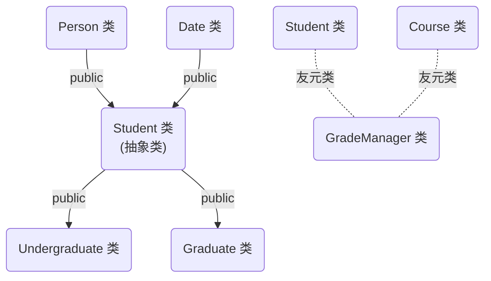

`GPAWizard`的七个类的UML图如下所示：

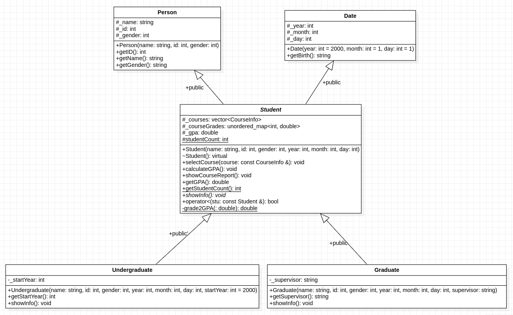

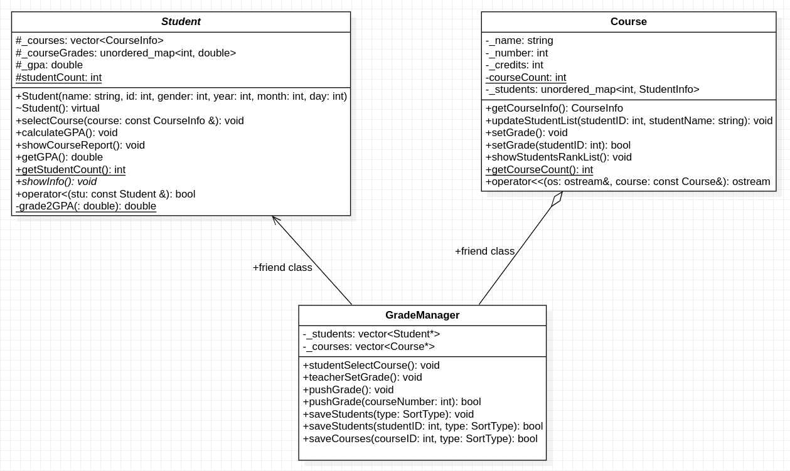

## 3.2 功能模块设计

- 选课阶段

  ```mermaid
  graph LR
  start(开始选课)-->show(选择是否显示课程信息)-->n(不显示则查看 courses.txt 文档&#40不推荐&#41)
  start-->select(输入课程号选课&#40输入 0 结束&#41)-->legal(课程不存在或已选过,需重新输入)
  start-->change(当前同学选课结束,切换下一名学生)
  ```

- 教师赋分

  ```mermaid
  graph LR
  start(教师开始打分)-->show(选择是否展示选课学生信息&#40推荐展示&#41)-->skip(若无学生选课则自动跳过)
  start-->grade(依次给选课学生评分,数值需为浮点型百分制成绩)-->legal(输入不合法需重新输入)
  start-->rank(选择是否显示该课程学生排名)
  ```

- 成绩复议

  ```mermaid
  graph LR
  start(成绩复议开始)-->input(输入学生学号以开始复议&#40输入 0 结束&#41)-->legal(该学生不存在则需重新输入)
  start-->input1(输入待复议课程号&#40输入 0 结束&#41)-->legal2(该课程不存在则需重新输入)
  start-->grade(教师重新打分,然后返回上一步至结束)
  start-->turn(该学生复议结束,切换下一名学生)
  ```

- 成绩展示

  ```mermaid
  graph LR
  start(成绩展示)-->show(系统自动打印所有学生成绩单,计算 GPA)
  ```

- 保存信息

  ```mermaid
  graph LR
  start(保存信息)-->stu(保存所有学生信息)-->type(选择排序方式:姓名,学号,GPA)
  start-->stu_course(保存某个学生的课程信息)-->legal(该学生不存在则需重新输入)-->type
  start-->course_stu(保存某门课程的学生信息)-->legal1(该课程不存在则需重新输入)-->type
  ```

# 4 系统调试

在编写本程序的过程中，我主要遇到了以下问题：

- 由于学生类和课程类之间是相互独立的，在学生选课时不能很好的获取课程信息。因此我设计了 `CourseInfo` 结构体，用于存储课程名称、课程号以及学分数。

  ```C++
  typedef struct {
      std::string name;
      int number, credits;
  } CourseInfo;
  ```

- 同样的，在教师赋分时，需要一个容器来存储老师给学生打的分数。我使用了 `std::pair` 容器来存储学生姓名和成绩信息，即

  ```C++
  using StudentInfo = std::pair<std::string, double>;  // <name, grade>
  ```

- 推送成绩是由管理类 `GradeManager` 来完成，它需要获取所有课程中给学生打的分数，再把这些分数推送给学生。具体逻辑是先遍历所有的课程，对于选择该课程的所有同学，先在所有的学生中找到该学生，再将成绩推送给学生本人。当学生数量和课程数量十分巨大时，本系统的性能并不理想，因此我使用了哈希表来存储学生的成绩，降低复杂度。具体做法为在课程类中新建一个哈希表容器：

  ```C++
  std::unordered_map<int, StudentInfo> _students;  // <id, <name, grade>>
  ```

  这样可以在 $O(1)$ 的时间修改、查找该学生的成绩。

- 在使用 `std::fstream` 进行保存文件时，我发现如果没有创建该文件则会保存失败，查阅相关资料后发现需要在打开方式中加上 `trunc` 即可。例如

  ```C++
  std::ofstream fout("shared/" + student->getName() + ".csv", std::ios::trunc);
  ```

- 在对待保存信息排序时，由于存在三种排序方法以及默认方法，代码容易变得冗长、不好阅读。为此我在 `IOUtils` 中定义了排序的枚举类型：

  ```C++
  typedef enum { NAME = 1,
                 NUMBER,
                 GRADE,
                 NONE = 0 } SortType;
  ```

  同时，我学习了 `lambda` 表达式的书写，使用标准库中的 `sort` 来对我的信息进行排序：

  ```C++
  switch (type) {
      case SortType::NAME:
          std::sort(students.begin(), students.end(), [](Student* a, Student* b) {
              return a->getName() < b->getName();
          });
          break;
      case SortType::NUMBER:
          std::sort(students.begin(), students.end(), [](Student* a, Student* b) {
              return a->getID() > b->getID();
          });
          break;
      case SortType::GRADE:
          std::sort(students.begin(), students.end(), [](Student* a, Student* b) {
              return a->getGPA() > b->getGPA();
          });
          break;
      case SortType::NONE:
      default:
          break;
  }
  ```

除此之外，在编程的过程中我还遇到了不少问题，经过查阅资料、仔细调试，我也收获了很多，在此就不再赘述。

# 5 测试结果与分析

## 5.1 编译

本项目使用 `cmake` 进行编译，编译结果放在 `build` 文件夹下，`cmake` 版本如下：

```bash
$ cmake --version            
cmake version 3.22.1

CMake suite maintained and supported by Kitware (kitware.com/cmake).
```

使用时先新建 `build` 文件夹，再在其中编译。为了方便使用，我写了一个小脚本 `compile.sh` 来辅助编译：

```bash
#!/bin/sh
if [ ! -d "build" ]; then
    mkdir build
fi
cd build
cmake ..
make -j12
```

使用时运行其即可。

```bash
$ ./compile.sh
-- The C compiler identification is GNU 11.4.0
-- The CXX compiler identification is GNU 11.4.0
-- Detecting C compiler ABI info
-- Detecting C compiler ABI info - done
-- Check for working C compiler: /usr/bin/cc - skipped
-- Detecting C compile features
-- Detecting C compile features - done
-- Detecting CXX compiler ABI info
-- Detecting CXX compiler ABI info - done
-- Check for working CXX compiler: /usr/bin/c++ - skipped
-- Detecting CXX compile features
-- Detecting CXX compile features - done
-- Configuring done
-- Generating done
-- Build files have been written to: /home/zlysm/Code/C++/THU-GPAWizard/build
[ 50%] Building CXX object CMakeFiles/GPAWizard.dir/src/Course.cpp.o
[ 50%] Building CXX object CMakeFiles/GPAWizard.dir/src/GradeManager.cpp.o
[ 50%] Building CXX object CMakeFiles/GPAWizard.dir/src/main.cpp.o
[ 66%] Building CXX object CMakeFiles/GPAWizard.dir/src/Student.cpp.o
[ 83%] Building CXX object CMakeFiles/GPAWizard.dir/src/IOUtils.cpp.o
[100%] Linking CXX executable GPAWizard
[100%] Built target GPAWizard
```

## 5.2 运行

运行 `run.sh` 即可启动本项目

```bash
#!/bin/sh
./build/GPAWizard
```

## 5.3 测试

本次测试选择 `test/1.in` 测试文件。

为了方便测试，我写了 `test.sh` 脚本进行辅助。运行时在其后添加一个数字参数 `*` ，即可使用输入输出重定向将 `*.in` 的测试结果保存至 `*.ans` ：

```bash
#!/bin/sh

test_number="$1"
input_file="test/${test_number}.in"
output_file="test/${test_number}.ans"

./run.sh <"$input_file" >"$output_file"
```

在这里我们手动进行输入（未列出部分重复环节，完整测试可使用测试文件）。

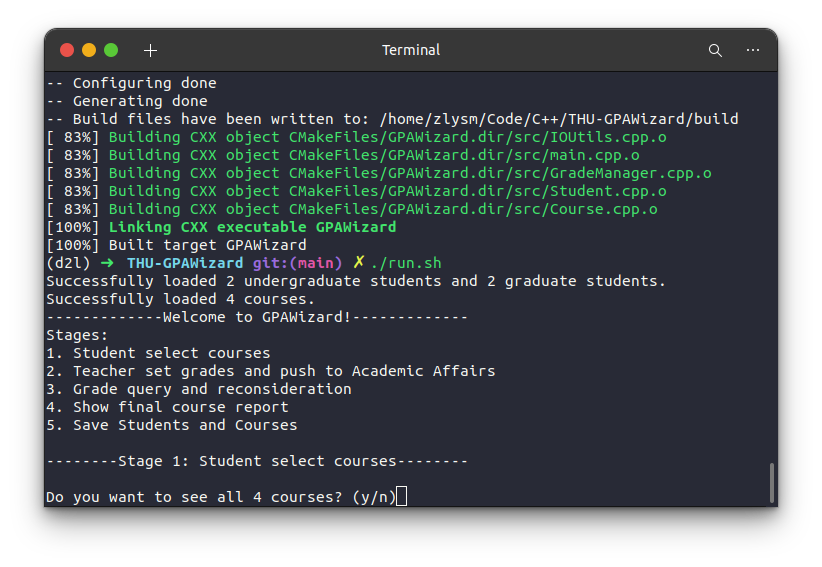

初始时可看到加载了四名学生以及四门课程，并提示了五个阶段。

**在选课阶段**，我们选择查看课程信息：

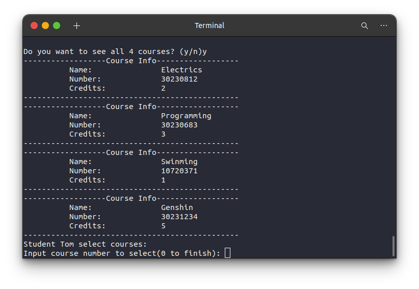

接下来我们为 `Tom` 进行选课，按照提示输入课程号即可：

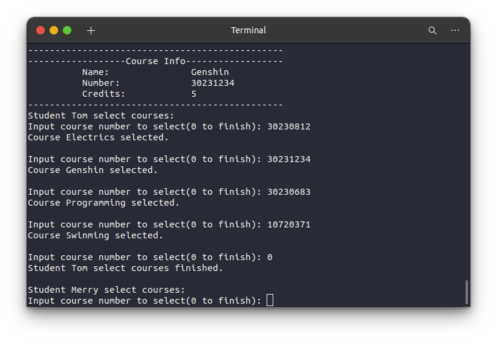

我们为 `Tom` 选择了`电电`，`原神`，`程设`以及`游泳课`，并输入 `0` 来结束他的选课过程。随后继续为其他同学选课，不再赘述。

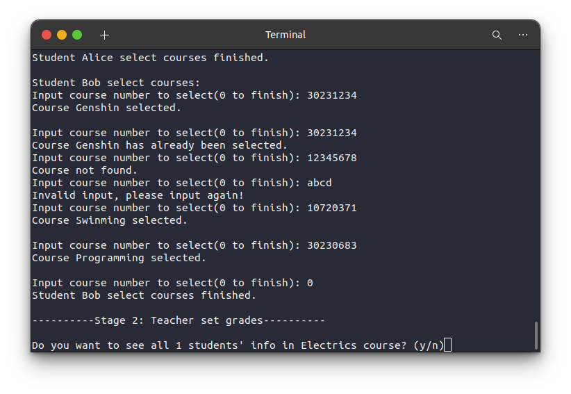

注意到，当重复选课、课程号错误、输入不合法时，系统均能给出正确的提示。

接下来我们**进入到教师打分环节**（本程序百分制与等级制对应关系与清华大学相同）。

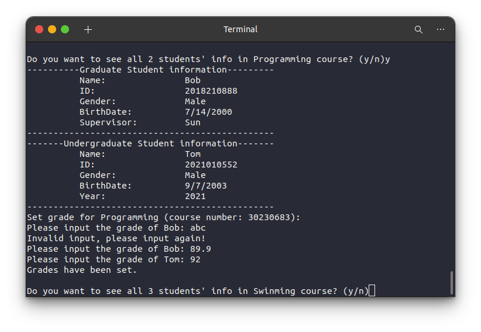

我们先显示选课学生信息，然后为其打分。注意到，当输入字母（不合法数据）时，会提示重新输入。

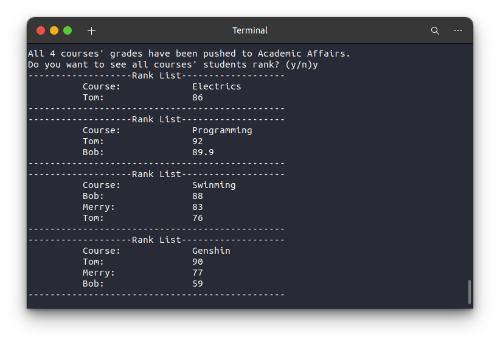

所有课程打分完成后，可以展示各课程学生成绩排名。

**接下来是复议环节。**`Bob`发现自己的`原神`课程挂科了，想要进行成绩复议：

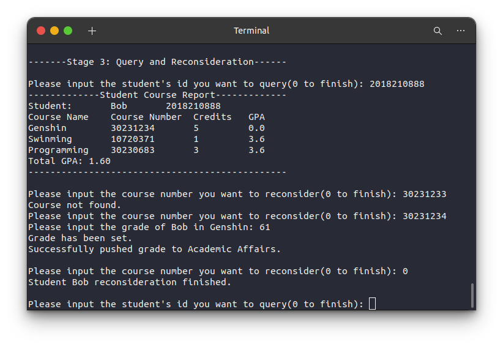

老师重新给他打了 `61` 分的分数，我们选择课程复议环节结束（当输入错误的课程号时，会提示找不到该课程）。

**进入到成绩展示环节**，系统会自动打印出所有同学的成绩单（`Alice` 为未选课同学）：

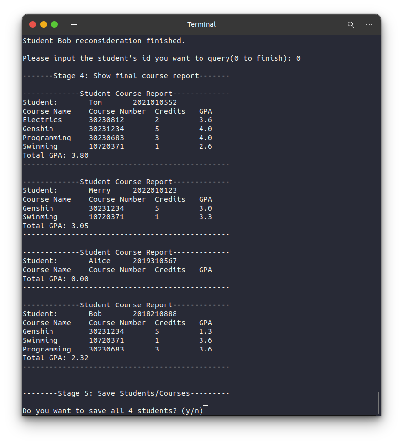

**进入到保存信息环节。**

先按照GPA降序的方法，保存所有学生信息至 `shared/StudentsInfo.csv`：

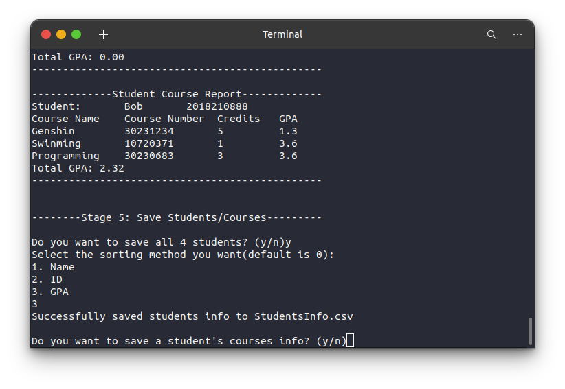

我们再来按照课程号排序的方法保存 `Tom` 的课程信息（每个同学的课程信息文件名为 `学生姓名.csv`）：

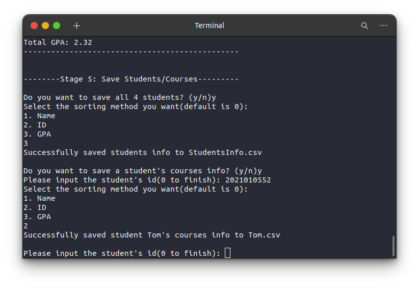

最后，我们来按照姓名排序的方法，保存`原神`课程的学生信息：

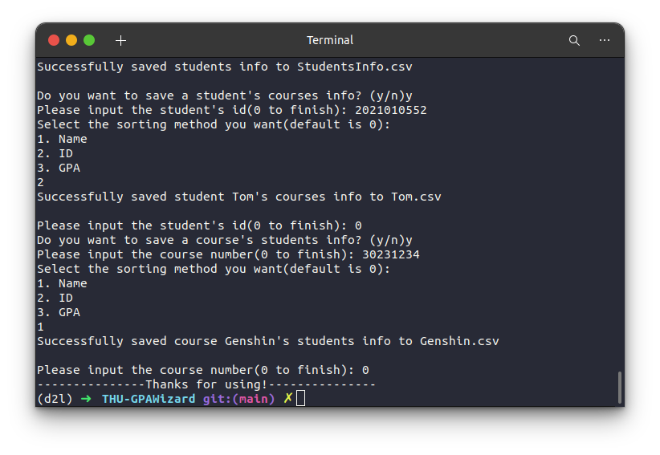

至此，整个程序结束。

## 5.4 分析

本程序的提示语较为丰富，用户界面较为美观，使用者根据提示内容即可正常运行本程序。此外，本程序还添加了一定的输入检查、信息检查，排除了不合法的输入以及不存在的数据，提高了系统的鲁棒性。其次，本次测试添加了四名学生和四门课程，在实际使用中，可以向 `students.txt` 以及 `courses.txt` 中按照第[2.2节](##2.2 初始信息要求)的要求添加更多的学生和课程，通过文件读写来完成初始化，理论上在 `2<<31 - 1` 内的数据均能处理。

但同时本系统仍存在一些缺陷，例如当选择是否展示某种信息时，理论上应输入 `y` 或 `n` 中的一种，但当输入的字节数超过两个时，多余的部分会留在缓冲区当做下一次的输入，造成错误；当输入课程号时理应输入整数，但当输入为小数时也会发生类似的错误，在输入鲁棒性上面还需进一步优化。

# 6 总结


在编写学生成绩管理系统的过程中，我深刻领悟了面向对象编程（OOP）的思想，学会了将复杂的问题抽象为不同的类和对象，将事务的特征抽象为属性，将事务的行为抽象为方法。这种抽象和封装使得代码更加模块化，易于维护和理解。

此外，我还进一步加深了对于函数重载、类的继承派生、虚继承、友元类等 OOP 关键概念的理解。这些概念为构建灵活且可扩展的系统提供了重要基础。例如，继承和派生使我能够创建新的类来重用已有类的属性和方法，并通过派生类来定制和扩展功能；函数重载使我能够在同一类中定义多个具有相同名称但拥有不同参数列表的函数，为系统提供了更多的灵活性。

在数据结构方面，我学习了哈希表和键值对的概念，它们可以更高效的进行查找、修改，对于管理学生成绩等信息尤为有用。同时，我还尝试了一些现代 C++ 语法特性，包括 auto 类型推导、 lambda 表达式以及左值右值等。这些特性不仅使代码更加清晰，还提高了代码的效率。例如，使用 lambda 表达式可以更方便地定义匿名函数，而 auto 类型推导则减少了代码中不必要的类型声明，使代码更加精简。

最后，在项目的编译和链接阶段，我成功地应用了 CMake 工具来管理本项目九个文件的编译和链接过程。 CMake 增强了项目的可维护性，同时还保证了跨平台的兼容性，使得项目更加便于维护。

然而美中不足的是，此次学生成绩管理系统还有诸多缺陷，`main` 函数也并没有发挥各种类的全部功能。但是在小学期中我还是收获了一个较为难忘得编程体验，有时一坐就是一天，虽然编写代码、 debug 的过程比较辛苦，我还是学到了不少知识。在此，**我十分感谢老师与各位助教这一个学期以来的辛勤付出，为我提供了不可或缺的帮助。**

此次学生成绩管理系统项目对我来说，不仅是技术层面的提升，更是思维方式和问题解决能力的锻炼。在不断面对挑战和解决问题的过程中，我培养了坚韧不拔的精神和耐心，学会了更系统地分析和设计解决方案。虽然项目还存在一些不完善之处，但我坚信这是一个不断学习和改进的过程。我将继续深入研究面向对象编程以及其他编程概念，不断提高自己的技能水平。同时，我也期待将所学应用到未来的项目中，为解决更复杂的问题和挑战做出更大的贡献。
